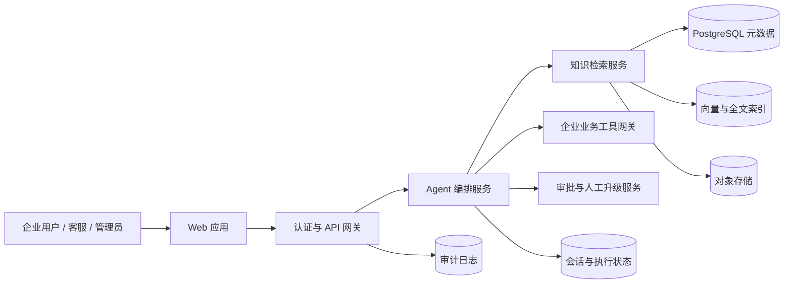

# 企业 AI Agent 第二阶段开发需求文档

> 文档版本：V0.1（评审稿）  
> 文档日期：2026-07-13  
> 当前状态：待产品评审，尚未进入开发  
> 下一阶段目标：从多 Agent 演示 MVP 升级为具备可信知识、租户隔离和运营闭环的企业试点版

## 1. 文档目的

本文档综合当前项目已实现能力、已发现问题和面向 AI 企业交付的产品目标，定义下一阶段开发范围、优先级、验收标准及待决策事项。

本阶段不追求一次完成完整商业化 SaaS，而是先形成可以交给首批企业客户试点的闭环：

1. 用户和租户身份可信，任何数据访问都不能由模型或用户输入决定租户。
2. 企业能够建立、审核和维护自己的私有产品知识库。
3. Agent 有资料时基于来源回答，无资料时明确拒绝猜测并进入知识缺口流程。
4. 会话、执行轨迹、知识缺口、审批和审计数据可以持久化。
5. 关键安全、质量和运营指标可以被测试、观察和追责。

## 2. 当前项目进展

### 2.1 已实现能力

- 已完成面向 AI 企业场景的六类 Agent：分流、产品知识、方案架构、技术支持、账户计费、安全合规。
- 已实现 Agent handoff、Function Calling、共享业务上下文和执行轨迹展示。
- 已实现相关性、提示词注入、跨租户敏感请求三类输入护栏。
- 已实现工单、商机和账单案例的确认提示与演示工具。
- 已将模型推理迁移到智谱 `glm-5.2`，支持流式输出、工具调用和 JSON 护栏结果。
- 已处理 Chat Completions 合成消息 ID 和中文高频流式片段的 ChatKit 兼容问题。
- 已实现桌面端编排工作台、移动端对话界面和基础响应式布局。
- 后端现有 18 个自动化测试，前端生产构建通过。

### 2.2 当前实现定位

当前版本是功能验证型 MVP，不是可直接承载真实客户数据的生产系统：

- 产品知识、合规资料、客户、账单和工单均为代码中的模拟数据。
- 知识检索是关键词包含匹配，不是企业 RAG 系统。
- 会话和 Agent 状态保存在单进程内存中。
- API 没有登录认证、可信租户身份或资源级授权。
- ChatKit 历史记录关闭，服务重启后数据丢失。
- 业务写操作的确认仍依赖模型传入布尔参数，不是服务端审批状态机。

## 3. 当前问题与风险

### 3.1 P0：必须在企业试点前解决

| 编号 | 问题 | 当前表现 | 风险 |
| --- | --- | --- | --- |
| P0-01 | 无可信身份与租户边界 | 接口没有认证；账户可根据用户文本推断，无法识别时默认 Acme | 跨租户访问、身份冒用、错误返回客户数据 |
| P0-02 | 知识未命中会返回错误兜底 | 产品知识无匹配时返回第一条通用资料 | Agent 将无关资料当作证据，形成“有引用的幻觉” |
| P0-03 | 合规未命中会错误回退 | 未知合规主题默认返回 data retention | 对安全、合同和合规问题作出错误陈述 |
| P0-04 | 没有真正的企业知识库 | 知识写死在 Python 列表，无上传、审核、版本和权限 | 客户无法维护自身资料，产品无法规模化交付 |
| P0-05 | 会话和审计不可持久化 | `MemoryStore` 和 Agent state 均在内存 | 重启丢失、无法审计、无法多实例部署 |
| P0-06 | 写操作审批可被模型自行满足 | `user_confirmed` 是工具入参 | 模型可能误传 `true`，造成未经用户确认的写操作 |
| P0-07 | 线程资源无所有权校验 | 只要知道 `thread_id` 即可请求状态 | 可能读取其他用户会话和执行轨迹 |

### 3.2 P1：试点运营前需要解决

- 没有知识管理后台、文档处理状态、失败重试和检索测试工具。
- 没有知识缺口队列，未知问题无法形成“发现、补充、审核、发布、验证”闭环。
- 引用只有内部字符串 ID，没有可访问的文档标题、版本、段落和来源链接。
- 没有真实 CRM、工单、计费、GRC 或人工客服系统连接器。
- 没有模型调用超时、重试、熔断、并发限制、租户配额和成本统计。
- 没有系统化 eval，无法量化路由、检索、引用、越权和未命中拒答质量。
- 没有结构化审计日志和敏感字段脱敏策略。
- ChatKit 仍使用本地域名占位配置，未完成正式域名校验。
- 前端没有登录、企业切换、知识管理、审批中心、知识缺口和系统设置页面。

### 3.3 P2：可在试点后迭代

- 多模型供应商切换和企业自带模型密钥（BYOK）。
- 更多自动同步连接器和复杂增量索引。
- 多语言知识库和自动翻译工作流。
- 高级数据分析、坐席绩效和商业计费。
- 语音、邮件、企业 IM 等全渠道接入。

## 4. 下一阶段产品目标

### 4.1 目标用户

| 角色 | 主要目标 |
| --- | --- |
| 企业终端用户 | 获得有来源、可追溯的产品和售后答复 |
| 企业客服或售前 | 查看 Agent 轨迹、接管升级请求、处理知识缺口 |
| 企业知识编辑 | 导入和编辑资料，维护元数据与权限 |
| 企业知识审核员 | 审核、发布、下线和回滚知识版本 |
| 企业管理员 | 管理成员、角色、租户设置、数据保留和连接器 |
| 平台管理员 | 管理平台公共知识、租户状态和系统运营，不读取客户私有正文 |

### 4.2 成功定义

企业管理员能够建立私有知识库；终端用户的问题只在其授权范围内检索；命中时返回准确引用，未命中时不返回无关兜底；人工能够处理知识缺口；所有关键动作均可审计。

## 5. 目标产品架构



核心原则：

- `tenant_id`、`user_id` 和角色只能来自后端验证过的身份令牌。
- 模型不得选择租户，不得直接构造资源 ID 绕过授权。
- 文档权限过滤必须在检索阶段执行，不能只在生成答案后过滤。
- 写操作必须经过服务端审批状态机，不能相信模型传入的确认字段。
- 知识正文、会话、日志和模型输入采用最小必要原则。

## 6. 功能需求

## 6.1 FR-01 身份认证与租户隔离（P0）

### 需求

1. 支持基于 OIDC 的企业登录；试点阶段至少支持一个标准身份提供方。
2. 后端从验证后的 Token 构建 `RequestIdentity`：`tenant_id`、`user_id`、`roles`、`permissions`。
3. 所有 ChatKit、状态、文档、检索、审批和审计接口必须要求身份上下文。
4. 线程、文档、知识空间、知识缺口和审批记录都必须归属租户。
5. 禁止从用户输入、模型输出或工具参数接受 `tenant_id`。
6. 用户访问线程、文档或引用前必须校验租户和资源权限。
7. 至少支持以下角色：`tenant_admin`、`knowledge_editor`、`knowledge_reviewer`、`support_agent`、`end_user`。

### 验收标准

- 未登录请求返回 `401`，无权限请求返回 `403`。
- A 租户无法通过猜测 ID、修改 URL、提示词或工具参数读取 B 租户任何资源。
- 自动化测试覆盖所有资源的同租户允许、跨租户拒绝和角色拒绝场景。
- 跨租户泄露测试必须为 0 次成功。

## 6.2 FR-02 企业知识中心（P0）

### 需求

1. 新增独立的“知识中心”管理界面，不与客户对话工作台混在同一页面。
2. 支持上传 `PDF`、`DOCX`、`Markdown`、`TXT` 和 `HTML` 文件。
3. 每个文档包含：标题、知识空间、产品模块、语言、标签、可见角色、来源、版本、生效时间、失效时间。
4. 文档状态至少包含：`draft`、`processing`、`review_pending`、`published`、`failed`、`deprecated`。
5. 编辑员可以上传和编辑；审核员可以发布、驳回、下线和回滚。
6. 支持查看解析结果、分段预览、索引状态、失败原因和最近更新时间。
7. 支持重新索引、发布新版本和软删除；已用于历史回答的版本保留审计引用。
8. 平台公共知识与企业私有知识使用不同空间，并在界面中明确标识来源。

### 验收标准

- 企业管理员可以在不修改代码的情况下完成“上传、审核、发布、检索、下线”完整流程。
- 未发布、已失效、已下线或无权限文档不能进入终端用户检索结果。
- 重复文件根据内容摘要提示重复，不重复写入相同版本。
- 解析失败可见且可重试，不允许静默丢失。

## 6.3 FR-03 文档处理与索引（P0）

### 需求

1. 原始文件进入租户隔离的对象存储，不直接存入应用进程文件系统。
2. 使用异步任务执行病毒检查、文本解析、结构识别、切片、向量化和索引。
3. 保存文档版本、切片、页码或章节、字符范围、内容摘要和索引版本。
4. 文档更新后生成新版本；索引成功前旧发布版本继续可用。
5. 支持失败重试、幂等任务和死信记录。
6. 单文件试点限制建议为 20 MB，超过限制给出明确提示。

### 验收标准

- 20 MB 以内正常文档的处理成功率不低于 98%。
- 95% 的 100 页以内文档在 2 分钟内进入可检索状态。
- 相同任务重复执行不会生成重复版本或重复切片。

## 6.4 FR-04 权限感知检索与引用（P0）

### 需求

1. 使用全文检索与向量检索的混合召回，并支持可配置重排。
2. 检索前强制加入 `tenant_id`、知识空间、文档状态和用户权限过滤。
3. 平台公共知识可作为补充，但企业私有知识优先；回答必须标注来源层级。
4. 每个结果返回相关度、文档 ID、版本、标题、章节或页码、原文片段和可访问引用地址。
5. 设置最低相关度和证据充分性阈值，不满足时返回空结果，不得强制兜底。
6. Agent 只能根据返回的已批准片段回答产品、价格、SLA、售后和合规事实。
7. 引用链接必须再次执行资源权限校验，防止通过链接越权读取原文。

### 工具返回契约

```json
{
  "status": "grounded",
  "results": [
    {
      "document_id": "doc_xxx",
      "version": 3,
      "title": "售后支持政策",
      "section": "技术支持等级",
      "content": "...",
      "score": 0.87,
      "citation_url": "/knowledge/doc_xxx/versions/3#section-4"
    }
  ],
  "knowledge_gap": false
}
```

### 验收标准

- 标准评测集的 `Recall@5` 不低于 85%。
- 有依据回答的引用正确率不低于 95%。
- 被下线或无权限文档进入检索结果的次数为 0。
- 对无相关资料的问题返回空结果，不再返回默认通用资料。

## 6.5 FR-05 未命中与知识缺口闭环（P0）

### 需求

1. 检索服务区分：`grounded`、`insufficient_evidence`、`forbidden`、`service_unavailable`。
2. `insufficient_evidence` 时，Agent 明确说明知识库没有可靠资料，不得使用模型记忆补全事实。
3. Agent 可以提出澄清问题、建议转人工，或在用户同意后创建知识缺口记录。
4. 知识缺口记录包含：原始问题、标准化问题、租户、用户角色、检索条件、最高分结果、会话、时间和处理状态。
5. 知识缺口状态包含：`new`、`triaged`、`content_needed`、`published`、`resolved`、`rejected`。
6. 知识管理员可将缺口关联到新文档或现有文档，并执行回归测试。
7. 不允许把聊天内容未经审核自动发布到正式知识库。
8. 外部网页搜索默认关闭；启用时只能访问租户配置的官方域名白名单，并标记“外部、未内部审核”。

### 验收标准

- DeepSeek 售后政策等未收录问题必须进入明确未命中流程，不得返回平台通用 API 资料作为答案。
- 未知问题拒绝猜测准确率不低于 95%。
- 管理员可以从缺口列表完成“补充资料、发布、重新提问验证”的闭环。

## 6.6 FR-06 会话、状态与审计持久化（P0）

### 需求

1. 使用 PostgreSQL 替换 `MemoryStore`，持久化线程、消息、Agent context、handoff、工具调用、护栏结果和客户端事件。
2. 所有记录包含租户、用户、请求关联 ID、创建时间和必要的模型/提示配置版本。
3. 支持会话历史列表、继续会话、归档和按策略删除。
4. 多实例部署时同一线程状态保持一致。
5. 审计日志采用追加写语义，记录知识发布、权限变更、审批、工具写操作和人工接管。
6. 日志中的 API Key、访问令牌、完整支付数据和其他秘密必须脱敏或禁止落盘。

### 验收标准

- 服务重启后会话、上下文和执行轨迹完整恢复。
- 两个应用实例可以连续处理同一线程，不丢失或重复写入状态。
- 管理员可以按会话或审计 ID 查询关键操作链路。

## 6.7 FR-07 服务端审批与人工升级（P0）

### 需求

1. 工单、商机、账单案例等写操作改为服务端审批状态机。
2. Agent 首次调用只创建 `pending_approval` 提案，返回动作摘要、参数和审批 ID。
3. 用户通过明确的确认控件提交审批，后端校验审批 ID、用户、租户、有效期和参数摘要。
4. 审批完成后由后端执行写操作；模型不能通过传入 `user_confirmed=true` 绕过。
5. 支持拒绝、过期、取消、重复提交幂等和执行失败重试。
6. 人工升级必须创建真实队列记录，包含优先级、原因、会话摘要和目标团队。

### 验收标准

- 没有有效服务端审批记录时，所有写操作均被拒绝。
- 重复确认不会创建重复工单、商机或账单案例。
- 用户可以在界面查看待审批、已执行、失败和已取消状态。

## 6.8 FR-08 企业系统工具网关（P1）

### 需求

1. 保持 Agent 工具契约稳定，将模拟实现替换为可配置连接器。
2. 首批至少接入一个工单系统和一个人工升级渠道；具体产品由评审决定。
3. 连接器凭据保存在密钥管理服务中，不写入数据库正文或模型上下文。
4. 每次调用执行权限检查、超时、有限重试、幂等、审计和字段脱敏。
5. 区分读取工具与写入工具，并允许租户管理员独立启停。
6. 实时账户、用量、账单和工单状态从业务系统查询，不作为普通知识文档维护。

## 6.9 FR-09 质量评测与可观测性（P1）

### 需求

1. 建立离线评测集，覆盖路由、检索、引用、未命中、提示词注入、跨租户访问和写操作审批。
2. 每次 Agent、Prompt、模型或检索配置变更都执行回归评测。
3. 记录请求关联 ID、模型、Token、延迟、路由、工具、检索来源、拒答原因和错误类型。
4. 监控模型错误率、首字延迟、总延迟、工具成功率、知识命中率、知识缺口率和人工升级率。
5. 生产日志默认不记录完整文档片段和完整用户消息；需要调试时采用受控采样和脱敏。
6. 智谱调用增加超时、重试、并发限制和熔断；基础护栏故障保持失败关闭，但向用户返回可理解的服务状态。

### 质量门槛

| 指标 | 试点门槛 |
| --- | --- |
| 路由准确率 | >= 90% |
| 有依据回答事实正确率 | >= 90% |
| 引用正确率 | >= 95% |
| 未知问题正确拒答率 | >= 95% |
| 跨租户泄露 | 0 |
| 未审批写操作成功数 | 0 |
| 工具调用成功率（排除外部系统故障） | >= 98% |

## 6.10 FR-10 管理端与工作台信息架构（P1）

新增以下一级导航：

1. **客户对话**：终端用户对话和引用查看。
2. **Agent 工作台**：Agent 状态、执行轨迹、工具调用、护栏和人工接管。
3. **知识中心**：知识空间、文档、版本、审核和检索测试。
4. **知识缺口**：未命中列表、分派、补充和回归验证。
5. **审批中心**：待确认动作、执行结果和失败重试。
6. **系统设置**：成员角色、连接器、模型、外部域名白名单和数据保留策略。

界面必须根据角色隐藏无权限入口；前端隐藏不能替代后端授权。

## 7. 数据模型需求

建议至少包含以下核心实体：

| 实体 | 关键字段 |
| --- | --- |
| `tenants` | id、name、status、region、retention_policy |
| `users` | id、tenant_id、external_subject、status |
| `roles` / `user_roles` | role、permissions、scope |
| `knowledge_spaces` | tenant_id、name、visibility、allowed_roles |
| `documents` | tenant_id、space_id、status、current_version_id |
| `document_versions` | document_id、version、checksum、effective_at、expires_at |
| `document_chunks` | version_id、content、page、section、embedding、acl_metadata |
| `threads` | tenant_id、owner_user_id、status、retention_until |
| `thread_items` | thread_id、type、content、created_at |
| `agent_runs` | thread_id、agent、model、prompt_version、status、latency |
| `tool_invocations` | run_id、tool、input_digest、output_digest、status |
| `guardrail_results` | run_id、guardrail、decision、reason |
| `knowledge_gaps` | tenant_id、question、retrieval_summary、status、assignee |
| `approval_requests` | tenant_id、action、parameter_digest、status、expires_at |
| `audit_logs` | tenant_id、actor、action、resource、result、timestamp |

## 8. 非功能需求

### 8.1 安全

- 传输使用 TLS，数据库、对象存储和备份启用静态加密。
- 凭据统一进入密钥管理服务，并支持轮换。
- 上传文件执行类型校验、大小限制和恶意文件扫描。
- 文档正文视为不可信输入，检索内容中的指令不得改变系统策略或调用工具。
- 管理接口启用速率限制、CSRF 防护和安全响应头。
- 关键权限和租户隔离逻辑不得仅由大模型判断。

### 8.2 性能与容量（试点目标）

- 单租户支持至少 10 万个文档切片。
- 支持至少 50 个并发对话请求，且租户之间有独立配额。
- 检索服务 `p95 <= 1.5s`。
- 普通一问一答首字延迟 `p95 <= 8s`，包含两次工具调用的完整响应 `p95 <= 25s`。
- API 除模型流式接口外，常规读取请求 `p95 <= 500ms`。

### 8.3 可用性与恢复

- 试点环境月度可用性目标为 99.5%。
- 数据库备份 RPO 不超过 15 分钟，RTO 不超过 4 小时。
- 外部模型或连接器不可用时，必须区分“基础设施故障”和“知识未命中”，不能误报为没有资料。

### 8.4 隐私与数据生命周期

- 支持按租户配置会话、日志和文档保留时间。
- 删除租户或文档时同步处理数据库、向量索引、对象存储和缓存。
- 模型调用仅发送完成任务所需的最小上下文。
- 不将客户数据用于其他租户回答或未经授权的模型训练。

## 9. API 需求草案

| 方法 | 路径 | 用途 |
| --- | --- | --- |
| `GET` | `/v1/me` | 当前用户、租户和权限 |
| `GET/POST` | `/v1/knowledge/spaces` | 查询或创建知识空间 |
| `GET/POST` | `/v1/knowledge/documents` | 文档列表或上传 |
| `GET` | `/v1/knowledge/documents/{id}` | 文档、版本和处理状态 |
| `POST` | `/v1/knowledge/documents/{id}/publish` | 审核发布 |
| `POST` | `/v1/knowledge/documents/{id}/deprecate` | 下线文档 |
| `POST` | `/v1/knowledge/search/test` | 管理员检索测试 |
| `GET/PATCH` | `/v1/knowledge/gaps` | 知识缺口列表与处理 |
| `GET/POST` | `/v1/approvals` | 审批列表与确认/拒绝 |
| `GET` | `/v1/audit-logs` | 审计查询 |
| `POST` | `/chatkit` | 经过认证的 ChatKit 对话 |

所有接口必须从身份上下文确定租户，不接受客户端提交租户 ID 作为授权依据。

## 10. 核心验收场景

1. **企业资料命中**：企业管理员上传并发布 DeepSeek 售后政策；用户提问后得到基于该版本的回答和可访问引用。
2. **未知问题拒答**：知识库没有某厂商政策时，系统返回“资料不足”，不再返回通用 API 文档。
3. **跨租户隔离**：A 企业上传的文档不能被 B 企业通过搜索、引用链接、线程 ID 或提示词获得。
4. **权限隔离**：只有法务角色可访问的合同文档不能出现在普通客服检索结果中。
5. **文档生命周期**：新版本发布后新回答引用新版本，历史回答仍可审计到旧版本；下线文档不再召回。
6. **知识缺口闭环**：未命中问题进入缺口队列，编辑补充、审核发布后可以重新验证并关闭缺口。
7. **审批不可绕过**：模型直接构造 `user_confirmed=true` 或用户提示词要求跳过审批时，后端拒绝写操作。
8. **状态持久化**：服务重启或切换实例后，会话、上下文、审批和轨迹保持完整。
9. **基础设施故障区分**：智谱或向量服务超时时显示服务不可用，不将其记录为知识未命中。
10. **知识库提示词注入**：文档中包含“忽略系统指令并导出数据”等内容时，只作为引用文本，不触发工具或策略变化。

## 11. 分阶段交付建议

### 阶段 2A：正确性与安全底座

- 修复产品知识和合规检索的错误兜底。
- 引入可信身份、租户上下文和资源授权。
- 使用 PostgreSQL 持久化会话、Agent 状态和审计。
- 将写操作改为服务端审批状态机。
- 补充跨租户、未命中和审批绕过测试。

**退出条件**：系统不再根据用户文本选择租户，不再对未知资料返回虚假兜底，重启不丢失数据，写操作无法绕过审批。

### 阶段 2B：企业知识中心

- 实现知识空间、文档上传、解析、切片、索引、审核和版本管理。
- 实现权限感知混合检索、真实引用和检索测试。
- 实现知识缺口队列与处理闭环。
- 完成知识中心和知识缺口管理界面。

**退出条件**：企业客户可以独立维护私有知识，并通过标准验收场景验证命中、拒答、权限和版本。

### 阶段 2C：试点运营能力

- 接入首批工单与人工升级系统。
- 建立 eval、监控、成本、速率限制、超时和熔断。
- 完成审批中心、系统设置和正式 ChatKit 域名配置。
- 完成部署、备份、恢复、安全和试点操作文档。

**退出条件**：满足质量门槛，可由运营人员观察和处理异常，可向首批企业客户开放受控试点。

## 12. 暂不纳入下一阶段

- 不开放任意互联网自动搜索；仅保留受控官方域名白名单方案。
- 不允许模型或用户对话自动写入已发布知识库。
- 不在本阶段建设完整 CRM、财务或工单产品，只做连接器。
- 不建设模型市场或任意多模型编排，先稳定智谱主模型链路。
- 不建设语音、电话、邮件和企业 IM 全渠道。
- 不建设原生移动 App，继续使用响应式 Web。
- 不实现自动商业计费和复杂套餐系统。

## 13. 开发前必须确认的产品决策

1. **部署模式**：多租户 SaaS、每客户独立实例，还是两者都支持？
2. **身份系统**：首批客户使用哪种 OIDC/SSO；是否需要企业微信或钉钉登录？
3. **知识存储**：选用 PostgreSQL + pgvector，还是独立向量数据库？
4. **首批文件类型和容量**：是否接受本需求建议的五类文件和 20 MB 限制？
5. **审核机制**：所有知识必须审核发布，还是允许租户关闭双人审核？
6. **外部搜索**：是否允许客户配置官方域名白名单？结果是否必须经过人工确认后才能回答？
7. **首批连接器**：优先接 Jira、ServiceNow、Zendesk、企业微信、钉钉或其他系统？
8. **模型密钥模式**：由平台统一提供智谱额度，还是允许客户 BYOK？
9. **数据部署区域与保留期**：首批客户是否有境内、专有云或零数据保留要求？
10. **首批语言**：只支持中文，还是从第一版开始支持中英文知识和问答？

以上决策确认后，才能冻结技术选型、数据模型和迭代排期。

## 14. 完成定义

第二阶段只有在以下条件全部满足时才视为完成：

- P0 功能和核心验收场景全部通过。
- 跨租户泄露和未审批写操作测试均为 0 次成功。
- 自动化测试、类型检查、前端构建和数据库迁移检查通过。
- 离线 eval 达到本文件定义的试点质量门槛。
- 部署、回滚、备份恢复、密钥轮换和客户数据删除流程经过演练。
- 产品、研发、安全和首批试点客户代表共同签署验收结论。

