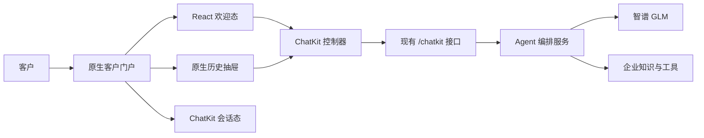

# 企业 AI Agent 客户前台原生欢迎态开发需求文档

> 文档版本：V0.1（评审稿）  
> 文档日期：2026-07-13  
> 所属阶段：阶段 3B-UI  
> 当前状态：阶段 3B-UI-A/B 已实现，阶段 3B-UI-C 待开发  
> 适用入口：`/support`

## 1. 文档目的

本文档定义客户前台 `/support` 的理想界面升级方案，重点解决当前 ChatKit 起始页存在的大面积无效留白、品牌表达弱、建议问题操作感不足和整体产品感不强等问题。

本次升级采用“原生 React 欢迎态 + ChatKit 会话态”的混合架构：

1. 新会话时，由平台自有 React 组件渲染企业品牌、欢迎语、建议问题、输入框和服务声明。
2. 用户发送第一条消息或打开历史会话后，切换到 ChatKit 会话界面。
3. Agent 编排、智谱模型、会话持久化、租户隔离、知识检索和审批逻辑继续复用现有后端。
4. 企业管理后台中的 ChatKit 测试会话保持现状，不纳入本次客户前台视觉重构。

## 2. 背景与问题

### 2.1 当前实现

当前客户前台使用全屏 `100dvh` 布局，并让 ChatKit iframe 填满头部与底部声明之间的全部剩余高度。ChatKit 的 `startScreen` 在 iframe 内部决定欢迎语、建议问题和输入框的纵向位置，外层页面无法直接调整其内部布局。

### 2.2 当前问题

| 编号 | 问题 | 影响 |
| --- | --- | --- |
| UI-01 | 欢迎内容上方留白过大 | 首屏视觉失衡，用户需要向下寻找可操作区域 |
| UI-02 | 建议问题为普通纵向文字列表 | 操作入口不明显，不像可点击任务 |
| UI-03 | 历史会话图标孤立在聊天区域右上角 | 缺少导航归属和文字说明 |
| UI-04 | 灰色页面中嵌套白色大边框 | 界面像演示组件，不像正式企业产品 |
| UI-05 | 企业品牌只出现在小型头部 | 企业服务主体和信任感不足 |
| UI-06 | 服务声明单独占据页面底部横条 | 与当前输入行为割裂，移动端容易换行占高 |
| UI-07 | 起始页与会话页使用同一空间分配 | 新会话需要紧凑欢迎态，会话进行中则需要最大消息空间，两种状态目标冲突 |

## 3. 产品目标

### 3.1 核心目标

1. 消除新会话首屏中的无效大面积留白。
2. 用户进入页面后可以立即看到欢迎语、建议问题和输入框。
3. 强化 AI 企业自己的品牌，而不是平台或底层组件品牌。
4. 保持现有 ChatKit 会话、历史记录和流式消息能力。
5. 不向客户前台暴露 Agent 路由、工具调用、护栏和内部上下文。
6. 桌面端和移动端都保持稳定尺寸、无重叠和无横向滚动。

### 3.2 成功定义

在常见桌面视口下，欢迎语距离内容区顶部不超过 120px，欢迎语、四个建议问题和输入框全部无需滚动即可看到；用户发送第一条消息后，页面平滑切换为完整会话视图，不丢失消息、不重复创建线程。

## 4. 技术结论

### 4.1 采用混合架构

当前项目使用的 `@openai/chatkit-react@1.3.0` 已提供以下控制方法：

- `sendUserMessage`：发送用户消息。
- `setComposerValue`：设置 ChatKit 输入框内容。
- `setThreadId`：切换当前会话。
- `focusComposer`：聚焦 ChatKit 输入框。

因此，本阶段不需要重写 ChatKit 会话协议。客户前台可以自行渲染欢迎态，并通过 ChatKit 控制方法发送首条消息或切换历史线程。

### 4.2 目标架构



### 4.3 保留与替换边界

| 能力 | 处理方式 |
| --- | --- |
| 企业品牌头部 | 原生 React 重构 |
| 新会话欢迎语 | 原生 React 重构 |
| 建议问题 | 原生 React 重构 |
| 首条消息输入框 | 原生 React 重构 |
| 历史会话抽屉 | 原生 React 新增 |
| 首条消息发送 | 调用 ChatKit `sendUserMessage` |
| 历史线程切换 | 调用 ChatKit `setThreadId` |
| 会话消息和流式输出 | 继续使用 ChatKit |
| 会话中的输入框 | 继续使用 ChatKit |
| 后台测试会话 | 保持现状 |
| Agent、模型、工具和知识库 | 保持现状 |

## 5. 页面状态模型

客户前台至少包含以下状态：

```text
loading
  ├── success + no active thread -> welcome
  ├── success + selected thread  -> conversation
  └── failure                    -> unavailable

welcome
  ├── fill prompt    -> welcome_with_draft
  ├── send message   -> starting_conversation
  ├── open history   -> history_open
  └── config failure -> unavailable

starting_conversation
  ├── accepted -> conversation
  └── failed   -> welcome_with_error

conversation
  ├── new conversation -> welcome
  ├── open history      -> history_open
  └── select thread     -> conversation
```

状态切换不得依赖视觉延时猜测，必须由 ChatKit 控制方法返回、线程变化事件或明确错误结果驱动。

## 6. 目标界面

### 6.1 桌面端结构

```text
┌──────────────────────────────────────────────────────────────┐
│ [Logo] 企业 AI 服务助手                         会话  ● 在线 │
├──────────────────────────────────────────────────────────────┤
│                                                              │
│             您好，今天需要什么帮助？                         │
│                                                              │
│             [技术故障]            [方案咨询]                 │
│             API、延迟与部署        企业 Agent 架构            │
│                                                              │
│             [安全合规]            [账户服务]                 │
│             安全、隐私与合规       套餐、用量与续费            │
│                                                              │
│             [请输入产品、技术或业务问题........] [发送]      │
│             回答基于企业已审核资料                           │
│                                                              │
└──────────────────────────────────────────────────────────────┘
```

### 6.2 移动端结构

```text
┌──────────────────────────┐
│ [Logo] AI 服务助手  会话 │
├──────────────────────────┤
│                          │
│ 您好，今天需要什么帮助？ │
│                          │
│ [技术故障] [方案咨询]    │
│ [安全合规] [账户服务]    │
│                          │
│ [请输入问题.........][↑] │
│ 回答基于已审核资料       │
└──────────────────────────┘
```

### 6.3 会话态

发送首条消息后：

- 移除原生欢迎语和建议问题区域。
- ChatKit 扩展到头部下方全部剩余空间。
- 保留原生企业头部、会话入口和服务状态。
- 服务声明改由 ChatKit disclaimer 或会话输入框下方的紧凑声明展示，不能重复出现。
- 会话消息区域从顶部开始展示，不保留欢迎态高度。

## 7. 视觉规范

### 7.1 页面尺寸

| 项目 | 桌面端 | 移动端 |
| --- | --- | --- |
| 顶部栏高度 | 60-64px | 56px |
| 欢迎内容最大宽度 | 840-920px | 100% |
| 欢迎内容顶部间距 | 80-120px | 40-64px |
| 建议问题布局 | 2 列 | 2 列 |
| 建议问题高度 | 64-72px | 52-60px |
| 建议问题间距 | 12px | 8px |
| 首条消息输入框高度 | 52-56px | 50-54px |
| 内容区水平内边距 | 24-32px | 16px |

### 7.2 字体层级

- 欢迎语：桌面 `24px/34px`，移动端 `22px/30px`，字重 `600`。
- 建议问题标题：`14px/20px`，字重 `600`。
- 建议问题摘要：`12px/18px`，字重 `400`。
- 输入文字：`15-16px`，移动端不得小于 `16px`，避免浏览器自动缩放。
- 服务声明：`12px/18px`。
- 所有文字 `letter-spacing: 0`，不根据视口缩放字号。

### 7.3 颜色与边界

- 页面背景使用浅中性灰，聊天工作区使用白色。
- 不使用渐变、装饰光斑、营销式背景图或大面积品牌色。
- 企业主色仅用于 Logo 底色、发送按钮、焦点和选中状态。
- 建议问题默认使用白色背景和中性边框，悬停时使用很浅的品牌色背景。
- 人工升级使用琥珀色状态，错误使用红色，在线使用绿色，避免所有状态均使用品牌青色。
- 卡片和输入框圆角不超过 `8px`。
- 客户前台不使用页面内大阴影；仅允许输入框或抽屉使用轻微阴影表达层级。

### 7.4 品牌头部

- 展示企业 Logo、助手名称和企业名称。
- 右侧展示“会话”入口和服务状态。
- 桌面端“会话”使用图标加文字，移动端可以使用图标，但必须提供 Tooltip 和无障碍名称。
- 服务状态来自后端，不允许永久写死为“在线”。
- 不在客户前台显示 `Enterprise Agent`、模型名称、OpenAI 或智谱技术标识。

## 8. 功能需求

## 8.1 FR-UI-01 原生欢迎态（P0）

### 需求

1. 新线程且没有用户消息时展示原生欢迎态，不展示 ChatKit `startScreen`。
2. 欢迎态从 `/v1/portal/config` 获取企业品牌、欢迎语、服务声明和建议问题。
3. 欢迎态最多显示 4 个主要建议问题；超过 4 个的配置不在首屏展示。
4. 欢迎区域不使用插画、Banner 或与任务无关的装饰填补空间。
5. 桌面高度不够时，优先压缩顶部间距和建议问题摘要，不隐藏输入框。

### 验收标准

- 在 `1366x768`、`1440x900` 和 `1920x1080` 下，欢迎语、建议问题和输入框无需滚动全部可见。
- `1440x900` 下欢迎内容顶部留白不超过 `120px`。
- 页面不存在高度超过 `160px` 且没有内容或交互的连续空白区域。

## 8.2 FR-UI-02 建议问题（P0）

### 需求

1. 建议问题使用稳定尺寸的 `2x2` 网格，不使用普通纵向文字列表。
2. 每项包含 Lucide 图标、短标题和一行摘要；移动端可隐藏摘要。
3. 点击建议问题只填入原生输入框，不自动发送。
4. 填入后保持输入框聚焦，用户可以编辑再发送。
5. 建议问题通过企业品牌设置管理，不得写死在前端。
6. 建议问题配置增加可选 `icon` 字段，值为平台允许的图标枚举。

### 验收标准

- 点击建议问题后，输入框显示完整问题文本，网络请求数不增加。
- 建议问题标题和图标在 `320px` 宽度下不重叠、不截断关键文字。
- 键盘用户可以使用 Tab 和 Enter 完成选择。

## 8.3 FR-UI-03 原生首条消息输入框（P0）

### 需求

1. 欢迎态使用原生 React 输入框和发送按钮。
2. 支持 Enter 发送、Shift+Enter 换行。
3. 空白消息不能发送；首条消息长度限制与后端保持一致。
4. 发送期间锁定重复提交，但允许用户看到原始文本。
5. 调用 ChatKit `sendUserMessage({text, newThread: true})` 发送首条消息。
6. 只有 ChatKit 接受消息并创建或绑定线程后，才能切换到会话态。
7. 发送失败时保留输入内容，并显示可重试错误，不得清空草稿。

### 验收标准

- 快速连续点击发送只产生一条用户消息和一个线程。
- 发送失败后草稿内容完整保留。
- 输入法组合输入过程中按 Enter 不得误发送。

## 8.4 FR-UI-04 欢迎态与会话态切换（P0）

### 需求

1. ChatKit 组件可以预加载，但欢迎态期间不得显示其默认欢迎页。
2. 首条消息成功后，ChatKit 会话态替换欢迎态，占满剩余内容区域。
3. 切换过程不能出现两个输入框、默认欢迎语闪现或消息重复。
4. 用户点击“新会话”时调用 `setThreadId(null)`，返回欢迎态并清空原生草稿。
5. 页面刷新后，有明确活动线程时直接恢复会话态；没有活动线程时进入欢迎态。

### 验收标准

- 欢迎态切换到会话态期间无明显布局跳动，累计布局偏移目标 `CLS < 0.1`。
- 不出现 ChatKit 默认欢迎语与原生欢迎语同时显示。
- 返回新会话后，历史线程仍可从会话抽屉打开。

## 8.5 FR-UI-05 历史会话抽屉（P0）

### 需求

1. 顶部“会话”按钮打开原生历史抽屉。
2. 新增 `GET /v1/portal/threads`，仅返回当前用户有权访问的线程摘要。
3. 线程摘要至少包含：线程 ID、标题、最后更新时间和最后一条消息摘要。
4. 选择线程后调用 ChatKit `setThreadId(thread_id)` 并进入会话态。
5. 支持新建会话；删除和重命名可继续由 ChatKit 或后续原生接口处理。
6. 历史抽屉在桌面端从右侧打开，移动端占据全屏宽度。

### 验收标准

- 用户不能看到其他用户或其他租户线程标题及摘要。
- 选择历史线程后显示对应消息，不创建新线程。
- 抽屉支持 Esc 关闭、焦点锁定和关闭后焦点恢复。

## 8.6 FR-UI-06 服务状态与错误状态（P0）

### 需求

1. `/v1/portal/config` 增加服务状态：`online`、`degraded`、`offline`。
2. 服务状态不能由前端永久写死。
3. `degraded` 时展示“部分服务受影响”，但仍允许输入。
4. `offline` 时禁用发送，并提供明确重试按钮。
5. 模型不可用、知识检索不可用、权限不足和网络故障使用不同错误文案。
6. 加载阶段使用稳定骨架或简洁加载状态，不允许长时间白屏。

### 验收标准

- 后端健康状态变化后，前台在下一次配置刷新时正确更新状态。
- 基础设施错误不会显示为“知识库未收录资料”。
- 错误区域不遮挡企业名称、历史入口和已有会话。

## 8.7 FR-UI-07 服务声明与来源（P1）

### 需求

1. 欢迎态服务声明位于输入框下方，不再使用页面级独立底部横条。
2. 会话态只能展示一次服务声明，避免外层和 ChatKit 重复。
3. 有引用的回答继续由会话态展示来源入口。
4. 未命中时继续明确说明资料不足，并允许转人工或形成知识缺口。
5. 服务声明、隐私政策和数据使用说明均由企业配置或可信平台配置提供。

## 8.8 FR-UI-08 品牌配置扩展（P1）

### 需求

品牌配置增加：

| 字段 | 类型 | 说明 |
| --- | --- | --- |
| `suggested_prompts[].icon` | 枚举 | 建议问题图标 |
| `welcome_title` | 字符串 | 欢迎态主标题，可回退到现有欢迎语 |
| `service_status_label` | 字符串 | 企业可选状态称呼 |
| `privacy_url` | URL | 隐私政策链接 |
| `support_hours` | 字符串 | 人工服务时段，可选 |

所有字段按租户隔离，并在管理后台品牌预览中真实展示。

## 9. API 需求

### 9.1 现有接口调整

`GET /v1/portal/config` 建议返回：

```json
{
  "branding": {
    "display_name": "Acme Intelligence",
    "assistant_name": "Acme AI 服务助手",
    "logo_url": null,
    "primary_color": "#0f766e",
    "welcome_title": "您好，今天需要什么帮助？",
    "support_notice": "回答基于企业已审核资料",
    "privacy_url": null,
    "suggested_prompts": [
      {
        "label": "技术故障",
        "prompt": "我们的 API 持续出现 429 和超时，请帮我诊断。",
        "icon": "wrench"
      }
    ]
  },
  "service": {
    "status": "online",
    "label": "服务在线"
  },
  "capabilities": {
    "history": true,
    "citations": true,
    "human_escalation": true,
    "anonymous_access": false
  }
}
```

### 9.2 新增历史接口

| 方法 | 路径 | 用途 |
| --- | --- | --- |
| `GET` | `/v1/portal/threads?limit=30&after=` | 当前用户历史线程摘要 |

返回示例：

```json
{
  "data": [
    {
      "id": "thr_xxx",
      "title": "API 429 与超时问题",
      "preview": "我们的 API 持续出现 429...",
      "updated_at": "2026-07-13T08:00:00Z"
    }
  ],
  "has_more": false,
  "after": null
}
```

接口不得返回 Agent 事件、工具参数、护栏结果、内部上下文或租户 ID。

## 10. 前端组件需求

建议组件边界：

| 组件 | 职责 |
| --- | --- |
| `SupportPortalShell` | 页面状态、配置加载、欢迎态和会话态切换 |
| `PortalHeader` | 企业品牌、历史入口、服务状态 |
| `WelcomePanel` | 欢迎标题、建议问题和原生输入框布局 |
| `SuggestedPromptGrid` | 建议问题网格、键盘操作和图标映射 |
| `WelcomeComposer` | 草稿、输入法、发送、防重复提交和错误恢复 |
| `ConversationStage` | ChatKit 预加载、显示和线程绑定 |
| `ThreadHistoryDrawer` | 历史列表、分页、线程选择和新建会话 |
| `SupportNotice` | 服务声明、隐私入口和人工服务时间 |
| `usePortalChatState` | 页面状态机和 ChatKit 控制器协调 |

不新增大型 UI 框架；继续使用 React、Tailwind 和 Lucide 图标。

## 11. 安全与隐私要求

1. 客户门户继续移除身份中的后台管理角色。
2. 历史线程接口只能返回当前用户自己的线程。
3. 客户前台不得订阅或展示 Runner 内部事件。
4. 建议问题、欢迎语和服务声明必须作为显示配置处理，不能进入系统 Prompt 或改变工具权限。
5. 服务状态接口不得返回模型密钥、供应商错误详情或内部基础设施地址。
6. 客户前台日志不得记录完整消息正文、令牌或 API Key。
7. 所有线程切换仍由后端执行租户和所有者校验。

## 12. 响应式与无障碍要求

- 最低支持宽度 `320px`。
- 验收视口至少包含：`320x568`、`390x844`、`768x1024`、`1366x768`、`1440x900` 和 `1920x1080`。
- 页面根元素不得出现横向滚动。
- 所有按钮点击区域不小于 `44x44px`。
- 输入框、建议问题、历史按钮和关闭按钮支持键盘操作。
- 使用语义化标题、表单标签、`aria-live` 错误提示和可见焦点。
- 抽屉打开后锁定焦点，关闭后恢复到历史按钮。
- 尊重 `prefers-reduced-motion`，状态切换动画不超过 `200ms`。
- 文本与背景满足 WCAG AA 对比度。

## 13. 性能要求

- 客户前台首屏可交互目标：本地和正常网络条件下 `p75 <= 2.5s`。
- 品牌配置加载期间使用稳定占位，避免布局跳动。
- ChatKit 在欢迎态期间可以后台预加载，但不得阻塞欢迎态渲染。
- 欢迎态 JavaScript 增量应保持轻量，不引入新的大型依赖。
- 历史抽屉首次只加载最多 30 条线程，后续分页。
- 切换历史线程不得重复初始化整个客户门户。

## 14. 测试要求

### 14.1 单元测试

- 欢迎态和会话态状态切换。
- 建议问题只填充、不自动发送。
- Enter、Shift+Enter 和输入法组合事件。
- 重复提交保护。
- 发送失败保留草稿。
- 服务状态与错误文案映射。

### 14.2 后端测试

- 历史线程仅返回当前用户数据。
- 跨用户、跨租户线程查询返回空或 `404`。
- 门户配置不返回内部标识和秘密。
- 服务状态结构稳定。

### 14.3 浏览器验收

- 六个规定视口截图检查。
- 欢迎内容顶部留白、建议问题尺寸和输入框可见性检查。
- 首条消息发送到会话态的完整流程。
- 历史抽屉打开、关闭和线程切换。
- 页面宽度与元素边界检查，确保无横向溢出和重叠。
- 客户前台 DOM 和网络响应中不包含 Agent 工具、护栏或内部上下文。

## 15. 核心验收场景

1. **正常进入**：用户打开 `/support`，在首屏直接看到品牌、欢迎语、4 个建议问题和输入框。
2. **建议问题**：用户点击“方案咨询”，问题填入输入框但不自动发送。
3. **编辑发送**：用户编辑问题后发送，只创建一个线程和一条用户消息。
4. **状态切换**：发送成功后原生欢迎态消失，ChatKit 会话态显示流式回答。
5. **发送失败**：网络失败时保留原始问题，可以重试。
6. **历史会话**：用户打开会话抽屉并选择历史线程，显示正确消息且不新建线程。
7. **新建会话**：从历史会话点击新会话后返回原生欢迎态。
8. **租户隔离**：A 企业用户看不到 B 企业品牌、建议问题和历史线程。
9. **内部信息隔离**：客户前台无法获取 Runner 事件、工具参数、护栏和内部上下文。
10. **服务降级**：模型不可用时显示服务降级或离线，不误报为知识未收录。
11. **桌面布局**：`1440x900` 下不存在超过 `160px` 的连续无效空白。
12. **移动布局**：`390x844` 下无横向滚动，欢迎语、建议问题和输入框无需页面滚动可见。

## 16. 分阶段实施建议

### 阶段 3B-UI-A：原生欢迎态（P0）

- 抽取 ChatKit 控制器和会话显示组件。
- 实现原生品牌头部、欢迎语、建议问题和首条消息输入框。
- 接入 `sendUserMessage`，完成欢迎态到会话态切换。
- 移除客户前台 ChatKit 默认 `startScreen` 和独立底部声明。
- 完成桌面与移动端布局验收。

**退出条件**：首屏无大面积无效留白，首条消息流程稳定，ChatKit 默认欢迎页不再出现。

### 阶段 3B-UI-B：历史与服务状态（P0）

- 新增门户历史线程摘要接口。
- 实现原生历史抽屉和新建会话。
- 接入真实服务状态和降级错误。
- 完成线程所有权和状态分类测试。

**退出条件**：用户可从原生客户门户安全切换自己的历史会话，并正确识别服务故障。

### 阶段 3B-UI-C：反馈与运营闭环（P1）

- 增加回答反馈和无帮助原因。
- 增加人工服务入口和状态。
- 将反馈关联知识缺口和运营分析。
- 完成品牌设置字段扩展和真实预览。

**退出条件**：客户反馈、人工升级和知识运营形成可追踪闭环。

## 17. 暂不纳入本需求

- 不重写 ChatKit 会话消息渲染和流式协议。
- 不建设语音、视频、电话或原生移动 App。
- 不在本阶段支持匿名客户访问。
- 不在本阶段支持文件附件上传。
- 不建设营销首页、产品宣传 Banner 或装饰性 Hero。
- 不修改企业管理后台 Agent 工作台布局。
- 不开放任意互联网搜索。

## 18. 开发前默认决策

为便于评审后直接开发，本需求采用以下默认决策：

- 客户前台使用原生 React 欢迎态，ChatKit 只负责会话态。
- 建议问题点击后填入输入框，不立即发送。
- 桌面和移动端均使用 2 列建议问题网格。
- 欢迎态最多展示 4 个主要建议问题。
- 历史会话使用原生右侧抽屉。
- 服务声明放在欢迎输入框下方，会话态只展示一次。
- 不使用装饰图片填补空白，直接压缩无效空间。
- 不新增大型前端依赖。

## 19. 完成定义

本需求只有在以下条件全部满足时才视为完成：

- 阶段 3B-UI-A 和 3B-UI-B 的 P0 功能全部完成。
- 12 个核心验收场景全部通过。
- 客户前台不再显示 ChatKit 默认欢迎页。
- 桌面端连续无效空白不超过 `160px`。
- 所有规定视口无横向滚动、文字重叠或控件遮挡。
- 首条消息、历史切换和新会话均不重复创建线程或消息。
- 跨租户和跨用户线程泄露测试为 0 次成功。
- 后端测试、前端类型检查、生产构建和浏览器验收全部通过。
- 产品负责人确认欢迎态、会话态、移动端和企业品牌预览效果。
