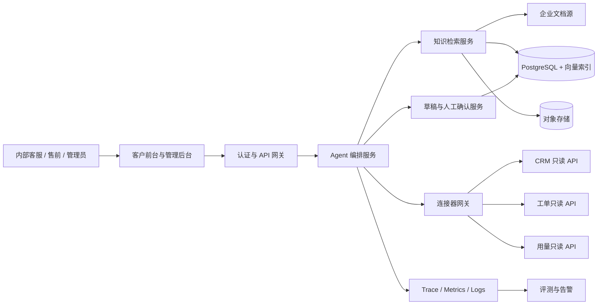

# 企业 AI Agent 生产化与内部灰度开发需求文档

> 文档版本：V0.1（评审稿）  
> 文档日期：2026-07-13  
> 当前状态：待产品与技术评审，尚未进入开发  
> 覆盖范围：阶段 2 剩余项、阶段 3 生产化、阶段 4 评测与灰度上线  
> 适用项目：Enterprise AI Support Agent

## 1. 文档目的

本文档基于当前项目的本地试点实现，定义从“可演示、可单实例试用”升级到“可接入真实企业系统、可安全持久化、可量化评测并可向内部团队灰度”的开发范围、边界、里程碑和验收标准。

本阶段完成后，系统应满足以下目标：

1. 能够读取真实 CRM、工单、企业文档和产品用量数据。
2. 所有可能改变外部系统状态的操作只生成平台内草稿，不自动写入外部系统。
3. 使用生产级身份、权限、持久化、审计和敏感数据保护能力。
4. 建立可重复执行的对话评测、Trace 评分、红队测试和 SLA 监控体系。
5. 在通过上线门禁后，仅向内部客服和售前团队进行小范围灰度。

## 2. 当前基线

### 2.1 已具备能力

- 智谱 `glm-5.2` 模型推理、多 Agent 路由、handoff、工具调用和流式回答。
- 独立客户前台 `/support` 和企业管理后台 `/admin`。
- 开发令牌与 OIDC 验证代码、可信租户和用户上下文、基础角色授权。
- SQLite + WAL 持久化的会话、消息、Agent context、执行事件、知识、审批和审计数据。
- 企业文档上传、同步解析、发布、下线、权限感知词法检索和知识缺口队列。
- 工单、商机和账单案例的服务端待审批提案。
- 相关性、提示词注入和跨租户敏感请求护栏。
- 客户前台品牌配置、历史会话和原生欢迎态。
- 后端自动化测试、前端生产构建和基础健康检查。

### 2.2 当前限制

- CRM、工单、账单、用量和人工服务均为演示适配器，不连接真实企业系统。
- 审批通过后只生成模拟外部 ID，不代表真实外部操作成功。
- SQLite、同步文档处理和本地文件流程不支持生产多实例部署。
- OIDC 尚未与正式企业身份提供方完成端到端联调和角色映射。
- 敏感字段过滤只有基础实现，尚未形成统一数据分类、脱敏和日志治理。
- 检索仍以词法召回为主，缺少向量召回、重排和持续评测。
- 没有标准对话测试集、Trace grader、系统化红队用例、SLA 仪表盘和灰度发布机制。

### 2.3 阶段判断

| 阶段 | 当前判断 | 本文档目标 |
| --- | --- | --- |
| 阶段 2：真实工具接入 | 工具契约和模拟流程已具备，真实连接器未完成 | 完成生产只读连接器和草稿写入边界 |
| 阶段 3：安全与持久化 | 本地单实例试点能力已具备 | 完成生产级身份、存储、权限、审计和脱敏 |
| 阶段 4：评测与上线 | 只有基础测试和健康检查 | 完成评测、监控、红队和内部灰度闭环 |

## 3. 核心原则

### 3.1 外部系统只读，写操作只生成草稿

本次开发必须采用 `draft_only` 外部写入策略：

1. CRM、工单、计费和用量连接器在生产环境只申请只读 OAuth Scope 或只读 API Key。
2. Agent 请求创建工单、商机、账单案例、客户备注、退款、套餐变更等动作时，只在平台数据库创建草稿。
3. 用户或管理员批准草稿后，状态只能变为 `approved_for_manual_execution`，不得自动调用外部系统写接口。
4. 人工人员在外部系统完成操作后，可以回填外部记录 ID 和执行结果。
5. 任何连接器不得通过 `POST`、`PUT`、`PATCH`、`DELETE` 或等效命令改变外部系统状态。
6. 后续如需自动执行，必须另立需求、重新进行安全评审，并为每个连接器显式开启。

### 3.2 身份和权限不由模型决定

- `tenant_id`、`user_id`、角色、数据范围和连接器授权只能来自后端验证后的身份与策略。
- 模型不能传入租户 ID、用户 ID、授权 Scope 或决定是否绕过人工确认。
- 所有资源访问在服务端执行租户、所有权、角色和数据范围校验。

### 3.3 有证据才回答，失败原因必须分离

- 产品、价格、SLA、售后、合同、安全和账户事实必须来自已授权的数据源。
- `insufficient_evidence`、`forbidden`、`connector_unavailable`、`model_unavailable` 和 `rate_limited` 必须分别处理。
- 连接器或模型故障不能显示为“知识库没有资料”。
- 未经企业审核的互联网内容不得作为正式企业答案。

### 3.4 默认最小化收集和可追责

- 只向模型和连接器发送完成当前任务所需的最少字段。
- 所有敏感读取、草稿创建、审批、权限变更和人工回填都必须写入审计日志。
- Trace、日志和评测样本默认不得保存密钥、令牌、完整支付数据或不必要的个人信息。

## 4. 范围与非目标

### 4.1 本期范围

- 连接器网关和连接器管理能力。
- CRM、工单、产品用量和企业文档的真实只读接入。
- 外部写操作的平台内草稿、人工批准和人工回填流程。
- PostgreSQL、多实例、对象存储和异步文档任务。
- 正式 OIDC/SSO、成员角色和资源级权限。
- 统一审计、敏感字段识别、脱敏和保留策略。
- 对话评测集、Trace grader、红队用例和回归门禁。
- 指标、日志、Trace、告警、SLA/SLO 和内部灰度流程。

### 4.2 非目标

- 不建设完整 CRM、工单、计费或客服坐席产品。
- 不允许 Agent 自动写入任何真实外部业务系统。
- 不提供退款、付款、账户删除、权限授予等高风险自动化执行。
- 不开放任意互联网搜索或未经审核内容自动入库。
- 不在本阶段建设原生移动 App、公开应用市场或完整商业计费系统。
- 不在首轮灰度中开放给外部付费客户或匿名互联网用户。

## 5. 目标架构



## 6. 里程碑

| 里程碑 | 目标 | 进入条件 | 退出条件 |
| --- | --- | --- | --- |
| M1 连接器基础 | 建立统一连接器网关和只读凭据模型 | 当前模拟工具契约稳定 | 沙箱真实读取成功，外部写请求为 0 |
| M2 草稿闭环 | 所有写意图形成平台内草稿 | M1 完成 | 草稿、批准、驳回、人工回填全链路可审计 |
| M3 生产安全 | 完成生产身份、数据库、异步任务和脱敏 | M1/M2 完成 | 多实例、安全和恢复验收通过 |
| M4 评测监控 | 建立质量、安全和 SLA 门禁 | M3 完成 | 核心评测与红队指标达到目标 |
| M5 内部灰度 | 向内部客服和售前小范围开放 | M4 通过 | 连续两个观察周期满足灰度退出标准 |

## 7. 功能需求

## 7.1 FR-01 连接器网关与配置（P0）

### 需求

1. 建立统一连接器接口，隔离 Agent 工具契约与各厂商 API 实现。
2. 每个连接器必须包含：`connector_id`、租户、类型、环境、状态、授权范围、健康状态、最近同步时间和配置版本。
3. 支持 `sandbox`、`staging`、`production` 环境，生产凭据不能在开发环境使用。
4. 凭据必须保存到密钥管理服务，数据库只保存密钥引用，不保存明文密钥。
5. 连接器调用必须支持超时、有限重试、指数退避、限流、熔断和请求关联 ID。
6. 所有返回结果转换为平台内部稳定契约，Agent 不直接依赖厂商字段。
7. 管理后台展示连接状态、权限 Scope、最后成功时间和可执行的只读测试。
8. 生产环境检测到写权限 Scope 时阻止连接器启用，并产生安全告警。

### 验收标准

- 更换同类型连接器实现时，不修改 Agent Prompt 和工具名称。
- 凭据不出现在数据库、前端响应、Trace、日志和错误信息中。
- 超时或限流返回明确的 `connector_unavailable` 或 `rate_limited`，不伪装成业务空结果。
- 生产连接器只读 Scope 自动检查通过，外部写请求计数为 0。

## 7.2 FR-02 CRM 只读接入（P0）

### 需求

1. 首期选择一个 CRM 作为正式适配器，建议 Salesforce 或 HubSpot 二选一。
2. 支持按可信用户身份或经过授权的客户标识查询企业账户、联系人、客户等级、合同状态和客户负责人。
3. 不允许模型自由搜索整个 CRM；查询范围必须受租户、用户关系和角色策略限制。
4. 字段采用白名单映射，内部备注、销售预测、个人手机号等字段默认不返回模型。
5. Agent 回答中不展示原始 CRM ID，前端按权限提供内部跳转链接。
6. CRM 数据只用于当前会话，不自动复制为知识文档。

### 验收标准

- 已授权用户可以查询自己的企业账户摘要。
- 未授权账户查询返回 `forbidden`，跨租户数据泄露为 0。
- CRM 不可用时明确提示业务系统暂不可用，不返回模拟数据。
- CRM 连接器不存在新增、修改和删除能力。

## 7.3 FR-03 工单系统只读与草稿（P0）

### 需求

1. 首期选择 Jira Service Management、Zendesk 或 ServiceNow 中一个作为正式适配器。
2. 支持读取当前用户有权查看的工单列表、状态、优先级、更新时间和公开回复。
3. 创建工单、追加回复、修改优先级和关闭工单只能生成平台内草稿。
4. 草稿包含目标系统、动作类型、摘要、正文、优先级建议、附件引用、来源会话和参数摘要哈希。
5. 草稿不得被描述为“工单已创建”；对用户统一显示“已生成待人工处理草稿”。
6. 人工在外部系统执行后，回填外部工单 ID、执行人、执行时间和结果。
7. 同一会话和动作摘要在幂等窗口内不得生成重复草稿。

### 验收标准

- 查询真实工单状态成功，并能区分业务无记录和连接器故障。
- 批准草稿不会向外部系统发送写请求。
- 人工回填后，草稿与外部工单关联可追溯。
- 快速重复确认只产生一条有效草稿。

## 7.4 FR-04 产品用量与账单只读查询（P0）

### 需求

1. 通过正式用量或计费 API 查询当前周期用量、配额、剩余额度、套餐和续费日期。
2. 金额、币种、计费周期和时区必须使用结构化字段，不允许模型自行计算关键账单数据。
3. 退款、额度调整、套餐变更、账单复核和发票申请只生成平台内草稿。
4. 对高敏账单字段执行角色和账户所有权校验。
5. 数据包含来源系统时间戳，过期数据必须标注“数据更新时间”。

### 验收标准

- 结构化用量与源系统抽样核对一致率为 100%。
- 无账单权限用户无法通过对话、URL 或工具参数读取账单数据。
- 计费系统不可用时不使用演示数据或模型估算替代。
- 所有账单写意图只生成草稿。

## 7.5 FR-05 生产文档检索（P0）

### 需求

1. 支持从一个企业文档源增量同步已批准内容，建议首期选择 Confluence、SharePoint 或受控对象存储目录。
2. 保留人工上传入口，并统一进入病毒扫描、解析、分段、索引和发布流程。
3. 使用全文与向量混合召回，并支持可配置重排。
4. 检索前强制过滤租户、知识空间、文档状态、版本有效期和用户权限。
5. 结果返回文档标题、版本、章节或页码、原文片段、分数、来源更新时间和授权引用链接。
6. 同步删除不得直接破坏历史引用，应将对应版本标记为失效并保留审计元数据。
7. 同步内容默认进入 `review_pending`，未经企业审核不得自动发布。

### 验收标准

- 标准知识评测集 `Recall@5 >= 85%`。
- 有依据回答的引用正确率 `>= 95%`。
- 未发布、失效或无权限文档进入结果的次数为 0。
- 文档源故障与无相关知识能够被准确区分。

## 7.6 FR-06 草稿、人工批准与人工回填（P0）

### 需求

1. 写意图统一转换为 `action_draft`，不得由各工具自行定义不一致的确认逻辑。
2. 草稿状态至少包含：`draft`、`pending_review`、`approved_for_manual_execution`、`rejected`、`manually_completed`、`expired`、`cancelled`。
3. Agent 只能创建 `draft`，不能批准、完成或回填外部 ID。
4. 提交审核前向用户展示目标系统、动作、关键参数、影响范围和敏感字段摘要。
5. 批准人必须拥有对应租户和动作权限，且不能批准自己无权查看完整内容的草稿。
6. 批准后不调用外部写接口，只进入人工执行队列。
7. 人工回填必须记录执行人、外部记录 ID、时间、结果和可选备注。
8. 草稿具有有效期、参数摘要哈希和幂等键；参数变化后必须重新确认。
9. 每次状态变化都写入追加式审计日志。

### 验收标准

- 模型、前端参数和重复请求都不能绕过人工批准。
- 批准前后外部系统写请求数均为 0。
- 参数被修改后原批准失效，必须重新审核。
- 任一草稿可以从会话、用户、审批和审计四个方向追溯。

## 7.7 FR-07 PostgreSQL 与多实例持久化（P0）

### 需求

1. 使用 PostgreSQL 替换生产环境 SQLite，SQLite 仅保留本地开发模式。
2. 为线程、消息、Agent 状态、工具调用、草稿、审计、知识和评测建立正式迁移脚本。
3. 使用乐观锁、事务或等效机制避免多实例下重复消息、重复草稿和状态覆盖。
4. 建立连接池、慢查询监控、索引策略和数据库容量告警。
5. 执行自动备份、时间点恢复和恢复演练，定义 RPO/RTO。
6. 敏感数据按分类采用字段加密或应用层加密，密钥与数据库分离。

### 验收标准

- 两个应用实例可以连续处理同一线程，不丢消息、不重复创建草稿。
- 从 SQLite 试点数据迁移后，记录数量和关键关联校验一致。
- 备份恢复演练满足 `RPO <= 24 小时`、`RTO <= 4 小时` 的内部试点目标。
- 数据库不可用时系统停止相关写入并明确报错，不静默降级到内存。

## 7.8 FR-08 对象存储与异步文档任务（P1）

### 需求

1. 原文件保存到租户隔离的对象存储，使用短时授权地址访问。
2. 上传后异步执行病毒扫描、解析、分段、向量化、索引和发布前检查。
3. 任务支持幂等、重试、退避、超时、取消和死信队列。
4. 文档处理状态和失败原因在管理后台可见。
5. 原文件、解析文本、切片和索引遵循统一保留与删除策略。

### 验收标准

- 20 MB 内常规文档处理成功率 `>= 98%`。
- 95% 的 100 页以内文档在 5 分钟内进入可审核状态。
- 恶意或不受支持文件不会进入解析和索引流程。
- 重复任务不会生成重复版本或重复切片。

## 7.9 FR-09 正式登录、成员与权限（P0）

### 需求

1. 至少与一个正式企业 OIDC/SSO 身份提供方完成联调。
2. 禁止生产环境使用 `DEV_AUTH_TOKEN` 和浏览器可见的共享开发令牌。
3. 建立身份组到平台角色的可审计映射，支持成员停用和会话撤销。
4. 权限同时覆盖页面、API、资源、字段和连接器数据范围。
5. 高权限角色启用多因素认证要求，并支持紧急访问审计。
6. 管理后台提供成员、角色、最近登录、状态和权限来源查询。
7. 默认角色遵循最小权限，新增成员不得自动获得管理员权限。

### 验收标准

- 未登录访问返回 `401`，无权限访问返回 `403`。
- 被停用用户的现有会话在规定时间内失效。
- 跨租户、越权 ID 枚举和角色提升测试成功次数为 0。
- 生产配置检查发现开发认证模式时阻止部署。

## 7.10 FR-10 审计与敏感字段脱敏（P0）

### 需求

1. 建立统一数据分类：公开、企业内部、客户敏感、个人信息、凭据秘密、受监管数据。
2. 为模型输入、模型输出、工具参数、工具结果、Trace、应用日志和审计日志分别定义字段策略。
3. API Key、访问令牌、密码、Cookie、完整银行卡号和私钥禁止落盘。
4. 邮箱、手机号、证件号、客户 ID 等按场景执行掩码、哈希或删除。
5. 审计日志采用追加写语义，记录身份、租户、动作、资源、结果、时间和关联 ID。
6. 审计正文不得保存超过调查所需的完整对话或文档内容。
7. 支持按租户配置会话、Trace、审计和原文件保留期限，并执行可验证删除。
8. 脱敏失败时，敏感 Trace 和日志应停止写入而不是明文降级。

### 验收标准

- 预定义密钥和令牌样本在日志、Trace、数据库普通字段中的明文出现次数为 0。
- 跨租户审计日志访问成功次数为 0。
- 所有草稿状态变化、连接器敏感读取和权限变更均可检索到审计记录。
- 数据删除演练后，活跃存储和索引中不存在应删除正文，并保留合法的最小审计证明。

## 7.11 FR-11 人工接管（P1）

### 需求

1. 用户可以申请人工服务，系统生成内部人工队列记录或外部工单草稿。
2. 对安全事件、法律承诺、重大商业承诺和 `SEV-1` 故障自动建议人工升级。
3. Agent 不得宣称“已联系人工”或“已创建工单”，除非状态真实支持该陈述。
4. 客服可以查看授权会话摘要、来源引用、草稿和风险标记，但不能看到无权限的敏感原文。
5. 人工接管、转派、处理和关闭均写入审计。

### 验收标准

- 人工请求可在后台查询并追溯至原会话。
- 高风险用例建议升级召回率 `>= 95%`。
- 未接通外部工单写入时，所有界面统一显示“待人工处理”，不伪造外部状态。

## 7.12 FR-12 对话测试集（P0）

### 需求

1. 建立版本化评测数据集，首版不少于 200 条用例。
2. 数据集至少覆盖：意图路由、知识命中、知识未命中、引用、CRM 查询、工单查询、用量查询、草稿写意图、越权、提示词注入、敏感信息和系统故障。
3. 每条用例包含输入、身份与租户、前置数据、期望 Agent、期望工具、允许/禁止行为、事实依据和评分规则。
4. 生产对话进入评测集前必须去标识化并经过授权审核。
5. 数据集、Prompt、模型、工具契约和知识快照必须有版本号，以支持结果复现。
6. 每次模型、Prompt、工具、检索或权限策略变更必须运行对应回归集。

### 首版用例建议

| 类别 | 最少数量 |
| --- | ---: |
| 路由与澄清 | 30 |
| 知识命中与引用 | 40 |
| 知识未命中与拒答 | 25 |
| CRM、工单和用量读取 | 35 |
| 草稿与人工确认 | 25 |
| 权限、越权和敏感信息 | 25 |
| 提示词注入与红队 | 15 |
| 服务故障与降级 | 5 |

### 验收标准

- 评测集可在 CI 和独立评测环境中重复执行。
- 同一版本输入、知识快照和配置能够生成可比较结果。
- 失败用例可追溯到完整的脱敏 Trace 和具体评分项。

## 7.13 FR-13 Trace grader（P0）

### 需求

1. 以平台自有 Trace 数据为评分输入，不依赖 OpenAI tracing。
2. Trace 至少记录：请求 ID、配置版本、路由、handoff、检索摘要、工具名称、工具结果状态、草稿状态、延迟、令牌和错误类型。
3. Grader 采用规则评分与模型评分组合：确定性安全约束使用规则，语义质量使用独立评分模型。
4. 评分维度至少包括：路由正确性、事实依据、引用正确性、工具选择、参数安全、未命中拒答、越权防护、草稿边界和回复完整性。
5. 评分模型不得看到密钥和不必要个人信息；评分结果保存评分模型与 Prompt 版本。
6. 对关键安全项采用一票否决，不允许平均分掩盖跨租户泄露或外部自动写入。

### 验收标准

- 每条评测用例生成逐项分数、证据和失败原因。
- 规则评分结果具有确定性，重复运行结果一致。
- 抽样人工复核与模型评分一致率 `>= 85%`。
- 跨租户泄露、凭据泄露和外部自动写入任一出现时，发布门禁失败。

## 7.14 FR-14 红队用例（P0）

### 需求

1. 建立自动化红队集，覆盖直接与间接提示词注入、工具参数注入、资源 ID 枚举、跨租户请求、角色提升、数据外带、敏感信息套取和确认绕过。
2. 文档内容中嵌入的恶意指令必须作为不可信数据处理。
3. 测试模型诱导 Agent 宣称工单已创建、虚构 CRM 数据或将连接器故障说成无业务记录。
4. 测试重复请求、并发确认、过期草稿、参数篡改和重放攻击。
5. 对连接器、文件上传、引用链接和管理 API 进行独立授权测试。

### 验收标准

- P0 红队用例通过率为 100%。
- 跨租户数据泄露、权限提升、明文凭据泄露和外部写入成功次数为 0。
- 间接提示词注入不会改变系统策略、调用未授权工具或泄露内部指令。
- 每个修复项必须新增对应回归用例。

## 7.15 FR-15 SLA 监控与告警（P0）

### 需求

1. 接入 Prometheus/OpenTelemetry 或等效体系，统一采集 Metrics、Logs 和 Traces。
2. 指标按环境、租户、模型、Agent、工具和连接器分类，但不得在标签中放入高基数字段或敏感信息。
3. 至少监控：请求量、成功率、首字延迟、完整回答延迟、模型错误、连接器错误、知识未命中率、人工升级率、草稿数量、护栏拦截率、成本和队列积压。
4. 建立服务、模型、连接器、数据库、队列和对象存储健康检查。
5. 告警必须包含严重级别、影响范围、关联 Trace、值班责任人和处理手册链接。
6. `insufficient_evidence` 不计为基础设施失败；连接器、模型、DNS、TLS 和超时错误必须单独统计。

### 内部试点 SLO

| 指标 | 目标 |
| --- | --- |
| 服务月可用性 | `>= 99.5%` |
| 非模型 API P95 | `<= 800ms` |
| 首字延迟 P95 | `<= 5s` |
| 只读连接器查询 P95 | `<= 3s` |
| 模型请求成功率 | `>= 98%` |
| P0 安全事件 | `0` |
| 外部系统自动写请求 | `0` |

### 验收标准

- 仪表盘能够从一次用户请求下钻到脱敏 Trace 和连接器调用。
- 人为制造模型超时、连接器限流、数据库不可用和队列积压时触发对应告警。
- 告警恢复后状态自动关闭并保留事件记录。
- 可用性报表不会把业务无结果或知识未命中计算为基础设施故障。

## 7.16 FR-16 内部灰度与回滚（P0）

### 需求

1. 首轮仅开放给经过培训的内部客服和售前人员。
2. 使用功能开关按租户、用户组、连接器和工具逐步启用能力。
3. 灰度分为三批：开发与产品人员、5-10 名内部客服/售前、扩大至 20-30 名内部人员。
4. 每批至少观察 5 个工作日，达到门禁后才能扩大。
5. 支持一键关闭真实连接器并回退到“仅知识问答 + 人工处理”，不得回退到模拟业务数据。
6. 灰度期间所有写意图继续保持 `draft_only`。
7. 建立用户反馈、问题分级、值班响应、事故复盘和版本回滚流程。

### 验收标准

- 功能开关关闭后，新请求不再调用对应连接器。
- 回滚不会丢失会话、草稿、审计和人工回填记录。
- 每批灰度均有质量、安全、SLA、反馈和已知问题报告。
- 出现 P0 安全事件、外部写入、跨租户泄露或持续 SLO 失败时自动停止扩大灰度。

## 8. 数据模型要求

### 8.1 连接器

```text
connector
  id
  tenant_id
  type
  provider
  environment
  status
  credential_reference
  granted_scopes
  config_version
  last_health_check_at
  last_success_at
  created_by
  created_at
  updated_at
```

### 8.2 动作草稿

```text
action_draft
  id
  tenant_id
  conversation_id
  source_message_id
  connector_id
  action_type
  status
  payload_encrypted
  payload_summary
  payload_hash
  idempotency_key
  requested_by
  reviewed_by
  reviewed_at
  expires_at
  external_record_id
  manually_completed_by
  manually_completed_at
  created_at
  updated_at
```

### 8.3 评测运行

```text
evaluation_run
  id
  dataset_version
  model_config_version
  prompt_version
  tool_contract_version
  knowledge_snapshot
  environment
  status
  aggregate_scores
  critical_failure_count
  started_at
  completed_at
```

## 9. 非功能需求

### 9.1 安全

- 全链路使用 TLS，服务间身份可验证。
- 生产密钥由密钥管理服务托管并支持轮换。
- 依赖、容器和上传文件进行安全扫描。
- 生产后台启用 CSP、安全 Cookie、CSRF 防护和严格来源控制。
- 高风险接口执行速率限制、重放保护和追加式审计。

### 9.2 可靠性

- 外部连接器故障不得阻断不依赖该连接器的知识问答。
- 重试仅用于安全且幂等的读取操作。
- 消息、草稿和审计写入采用事务或可恢复事件机制。
- 不允许生产故障时静默切换到演示数据。

### 9.3 性能与容量

- 使用脱敏压测数据验证目标并发和高峰流量。
- 对模型并发、连接器限流、数据库连接池和异步队列分别设置容量保护。
- 大型文档处理不得占用在线对话请求进程。

### 9.4 可维护性

- 连接器实现遵循统一接口和契约测试。
- 数据库、Prompt、工具契约、评测集和仪表盘配置均需版本化。
- 关键部署、回滚、告警和恢复流程必须有 Runbook。

## 10. 评测与发布门禁

### 10.1 质量门禁

| 指标 | 灰度最低标准 |
| --- | ---: |
| 意图路由准确率 | `>= 90%` |
| 工具选择准确率 | `>= 90%` |
| 知识 `Recall@5` | `>= 85%` |
| 引用正确率 | `>= 95%` |
| 未命中正确拒答率 | `>= 95%` |
| 高风险人工升级召回率 | `>= 95%` |
| 人工抽检事实正确率 | `>= 95%` |

### 10.2 安全门禁

以下任一条件不满足，不得进入或扩大灰度：

- 跨租户泄露为 0。
- 外部系统自动写请求为 0。
- P0 红队用例 100% 通过。
- 明文密钥、令牌和密码泄露为 0。
- 生产环境开发认证模式为关闭状态。
- 数据备份恢复和客户删除流程完成演练。

### 10.3 运营门禁

- 关键服务、模型和连接器均有仪表盘、告警和责任人。
- P0/P1 事故响应流程、人工接管流程和回滚 Runbook 已演练。
- 内部用户完成数据安全、草稿边界和结果核验培训。
- 已知问题有明确影响范围、规避方案和修复计划。

## 11. 测试要求

| 测试层级 | 必测内容 |
| --- | --- |
| 单元测试 | 权限策略、字段映射、脱敏、状态机、幂等和评分规则 |
| 契约测试 | CRM、工单、用量、文档源和模型供应商返回契约 |
| 集成测试 | OIDC、PostgreSQL、对象存储、队列、密钥管理和监控 |
| 端到端测试 | 登录、提问、真实读取、草稿、批准、人工回填和审计 |
| 安全测试 | 越权、注入、重放、敏感信息、文件上传和连接器 Scope |
| 评测回归 | 路由、事实、引用、工具、拒答、草稿和故障分类 |
| 容灾测试 | 模型、连接器、数据库、队列故障与备份恢复 |
| 浏览器测试 | 客户前台、管理后台、审批、连接器和监控关键流程 |

## 12. 开发拆分建议

建议按以下顺序开发，每一项均可独立验收：

1. 连接器网关、凭据引用、只读 Scope 检查和模拟契约测试。
2. 一个真实 CRM 只读连接器。
3. 一个真实工单只读连接器和统一动作草稿模型。
4. 一个真实用量/计费只读连接器。
5. 一个企业文档源同步、对象存储和异步处理流程。
6. PostgreSQL 迁移、多实例一致性和备份恢复。
7. 正式 OIDC/SSO、成员角色和生产配置门禁。
8. 统一审计、敏感字段策略、脱敏和数据删除流程。
9. 评测数据集、Trace grader 和 CI 回归门禁。
10. Prometheus/OpenTelemetry、SLA 仪表盘、告警和 Runbook。
11. 红队测试、容量测试和上线演练。
12. 三批内部灰度、观察、复盘和退出评审。

## 13. 交付物

- 连接器 SDK、正式只读适配器和契约测试。
- 连接器配置、健康检查和 Scope 审核页面。
- 统一动作草稿、人工审核、人工执行队列和回填页面。
- PostgreSQL 迁移、对象存储、异步任务和备份恢复脚本。
- 正式 OIDC/SSO 配置、成员角色页面和生产配置检查。
- 数据分类、脱敏规则、审计查询和删除流程。
- 版本化对话测试集、Trace grader、红队集和评测报告。
- Metrics、Logs、Traces、SLA 仪表盘、告警规则和 Runbook。
- 内部灰度计划、培训材料、每日观察报告和阶段复盘报告。

## 14. 待评审决策

开发开始前需要确认以下事项：

1. 首期 CRM：Salesforce、HubSpot，或企业自有 CRM。
2. 首期工单系统：Jira Service Management、Zendesk 或 ServiceNow。
3. 首期用量/计费数据源及可提供的只读接口。
4. 首期企业文档源：Confluence、SharePoint 或对象存储目录。
5. 正式 OIDC/SSO 身份提供方和角色组映射方式。
6. PostgreSQL、对象存储、队列、密钥管理和监控的部署环境。
7. 数据驻留区域、会话/Trace/审计保留期限和客户删除要求。
8. 内部灰度团队、人数、负责人和允许访问的真实数据范围。
9. `draft_only` 策略的人工执行责任人和外部 ID 回填流程。
10. 评测评分模型是否继续使用智谱独立配置，或使用规则加人工复核。

## 15. 开发启动条件

只有以下条件同时满足后，才进入开发：

1. 本文档经产品、技术、安全和试点业务负责人评审通过。
2. 首期四类数据源及对应沙箱或测试环境确定。
3. 明确确认生产连接器只读、外部写操作 `draft_only` 的边界。
4. 基础设施和身份提供方方案确定。
5. 灰度质量、安全和 SLA 门禁获得负责人确认。

本文档当前仅用于评审，不代表已批准开发，也不代表当前项目已具备生产上线条件。
